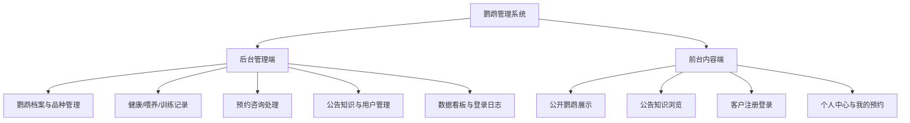
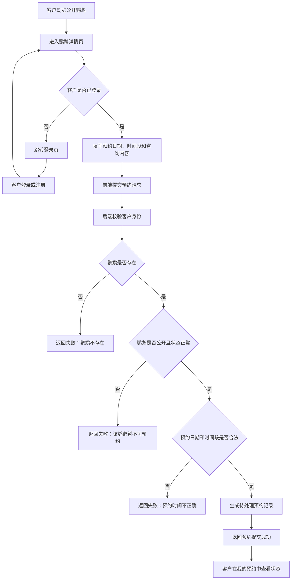
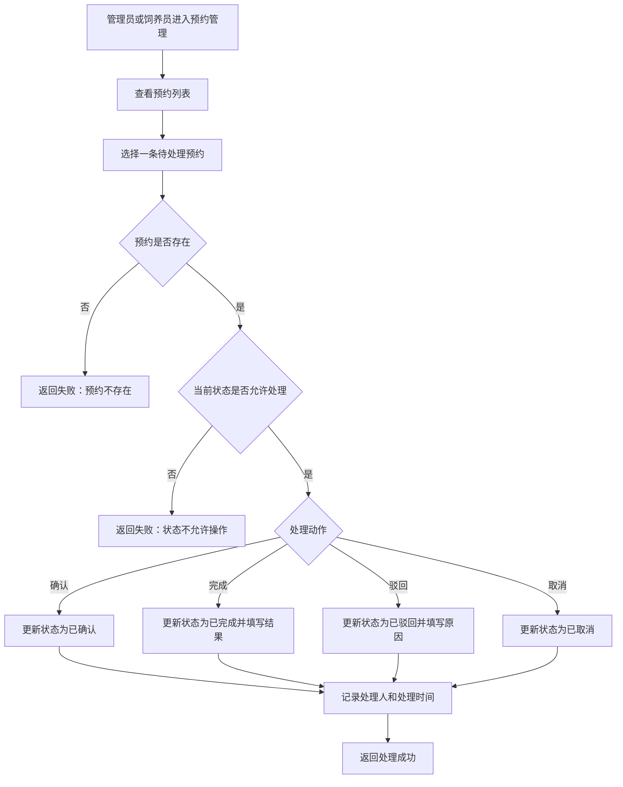
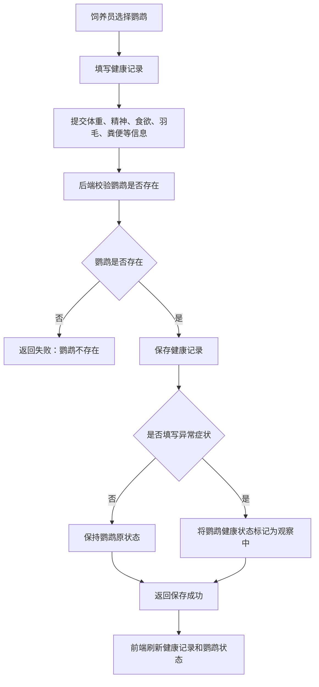
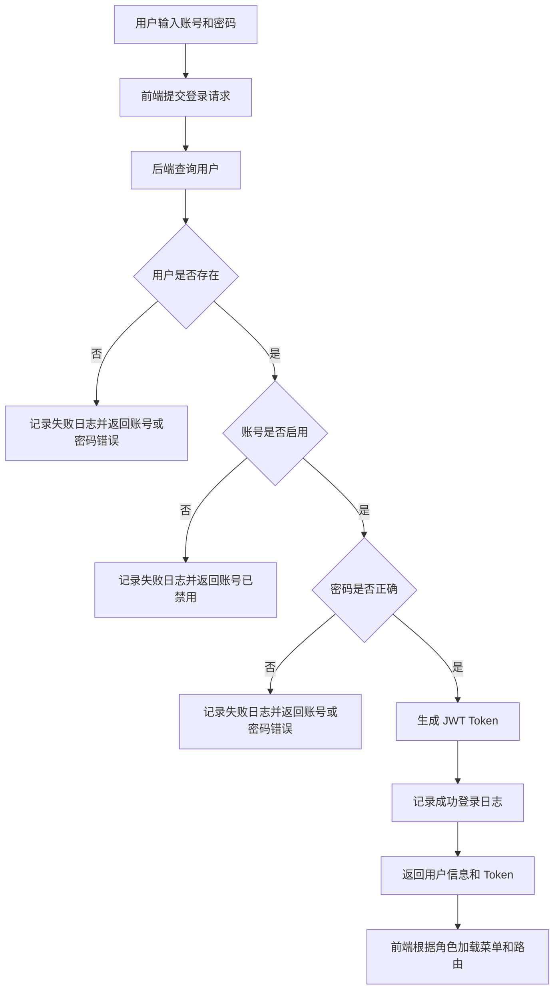
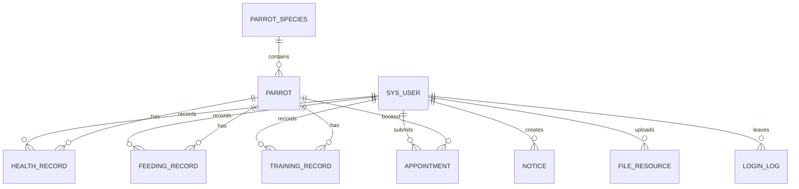
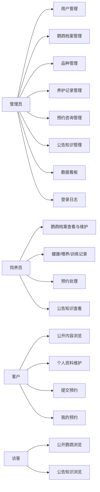
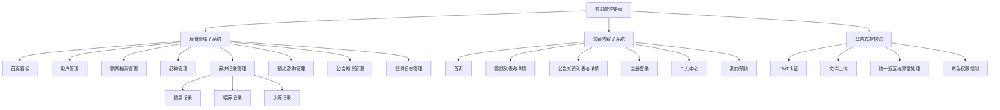

# 基于 Spring Boot 的鹦鹉管理系统需求分析说明书

# 1. 项目概述

## 1.1 项目名称

本项目名称为 **基于 Spring Boot 的鹦鹉管理系统**。

系统面向鹦鹉养殖机构、宠物乐园、展示咨询门店以及小型动物保护组织，主要用于解决鹦鹉档案分散、日常养护记录不规范、客户预约处理不及时、管理数据缺少统计支撑等问题。系统采用 Web 方式运行，分为后台管理端和前台内容端，内部人员通过后台完成业务管理，客户和访客通过前台浏览公开信息并提交预约咨询。

## 1.2 项目背景

近年来，鹦鹉逐渐成为宠物饲养和动物展示中的热门对象。与普通宠物相比，鹦鹉寿命较长，性格差异明显，日常管理不仅涉及基础档案，还涉及健康观察、喂养情况、训练情况、客户咨询和预约跟进等多个环节。如果继续依赖纸质记录、微信群沟通或零散的 Excel 表格，就容易出现信息查找慢、记录不完整、多人协作不清楚的问题。

在实际管理中，一只鹦鹉从入园、建档、日常喂养、健康检查、训练记录到对外展示和客户预约，都会产生大量数据。如果这些数据没有集中保存，管理员很难快速了解鹦鹉当前状态，饲养员也不方便追踪历史记录。对于提供展示、认养或咨询服务的机构来说，客户预约如果只靠人工登记，也容易出现时间冲突、处理遗漏和反馈不及时等情况。

因此，本系统希望通过信息化方式把鹦鹉档案、养护记录、预约咨询、公告知识、用户权限和统计看板整合到一个平台中，使日常管理更加清晰，也方便毕业设计答辩时展示完整业务流程。

## 1.3 建设目标

本系统的建设目标不是追求过度复杂的大平台，而是完成一套业务闭环清楚、功能能演示、数据能落库、界面能展示的本科毕业设计项目。系统需要满足以下目标：

1. 建立统一的鹦鹉档案库，记录鹦鹉编号、名称、品种、性别、年龄、颜色、图片、健康状态、公开状态等信息。
2. 支持品种资料管理，方便管理员维护鹦鹉品种、产地、体型、寿命、饲养难度和习性说明。
3. 支持健康、喂养、训练三类养护记录，让饲养员能够按日期记录日常情况，形成可追溯的养护过程。
4. 支持前台公开展示，访客可查看公开鹦鹉信息和公告知识，客户登录后可提交预约咨询。
5. 支持管理员或饲养员处理预约，包括确认、完成、取消、驳回和填写处理结果。
6. 支持角色权限控制，使管理员、饲养员、客户、访客看到的菜单和可执行操作不同。
7. 支持数据看板和图表统计，展示鹦鹉数量、待处理预约、健康异常数量、品种分布、预约趋势等信息。
8. 支持登录日志、文件上传、统一返回格式和异常处理，为系统运行和后续维护提供基础能力。

## 1.4 项目价值

本系统建成后，能够从业务管理、客户服务和毕业设计展示三个方面体现价值。

| 价值方向 | 具体说明 |
| --- | --- |
| 管理效率提升 | 鹦鹉档案、品种信息、养护记录集中管理，减少重复登记和人工查找。 |
| 养护过程可追溯 | 健康、喂养、训练记录按鹦鹉和日期保存，出现异常时可以追踪历史情况。 |
| 客户服务规范化 | 客户可在线提交预约，后台统一处理预约状态，减少遗漏和沟通混乱。 |
| 数据统计更直观 | 管理员可通过看板查看关键数据，为日常运营提供参考。 |
| 权限边界更清晰 | 不同角色使用不同功能，避免普通客户访问后台业务数据。 |
| 毕设展示更完整 | 系统包含登录、权限、CRUD、分页查询、文件上传、图表统计等常见毕业设计要点。 |

## 1.5 系统整体定位

系统定位为一套轻量级的鹦鹉业务管理平台，重点服务中小型鹦鹉养殖、展示和咨询场景。系统不做大型动物医院管理系统，也不做复杂电商交易平台，而是围绕“鹦鹉信息管理、养护过程记录、客户预约咨询、公开内容展示”四条主线展开。

---

# 2. 业务现状与痛点分析

## 2.1 当前业务现状

在传统管理方式中，鹦鹉相关业务通常由管理员、饲养员和客户分别参与。管理员负责整体资料维护和客户咨询安排，饲养员负责日常喂养、健康观察和训练记录，客户则通过电话、微信或到店咨询了解鹦鹉信息并预约参观或咨询。

这种方式在鹦鹉数量较少时勉强可用，但当鹦鹉个体、品种、养护记录、客户预约逐渐增多后，业务信息会变得分散。不同工作人员可能使用不同表格记录数据，图片文件单独存放，客户预约靠聊天记录保存，健康异常也可能只停留在口头沟通中。由于缺少统一系统，很多信息虽然被记录过，但后续查找、统计和追踪都不方便。

当前业务大致可以概括为以下几个环节：

| 业务环节 | 当前常见处理方式 | 存在的主要问题 |
| --- | --- | --- |
| 鹦鹉建档 | 使用纸质档案或 Excel 表格记录 | 图片、品种、健康状态和说明分散，修改后不容易同步。 |
| 品种维护 | 靠资料文档或人工经验说明 | 品种信息不统一，客户和新饲养员了解成本较高。 |
| 健康记录 | 饲养员手写或在群里汇报 | 异常情况难以长期追踪，也不方便按鹦鹉查询历史。 |
| 喂养记录 | 口头交接或简单打卡 | 是否按时喂养、是否吃完、剩余情况缺少结构化记录。 |
| 训练记录 | 依赖饲养员个人笔记 | 训练项目、配合程度和后续建议难以沉淀。 |
| 预约咨询 | 电话、微信或现场登记 | 状态不清楚，容易忘记处理，客户无法自助查看。 |
| 公告知识 | 线下通知或零散文章 | 内容不集中，客户无法系统了解饲养知识。 |
| 数据统计 | 手工汇总 | 管理者无法及时掌握业务整体情况。 |

## 2.2 业务痛点分析

系统建设的必要性主要来自以下痛点：

| 业务环节 | 现状问题 | 影响 | 系统改进方向 |
| --- | --- | --- | --- |
| 鹦鹉档案管理 | 鹦鹉基础信息、图片和状态记录分散 | 管理员查找效率低，客户看到的信息可能不是最新的 | 建立统一档案管理功能，支持编号、品种、图片、状态和公开展示维护。 |
| 品种资料管理 | 品种习性、寿命、饲养难度没有统一资料库 | 新员工学习成本高，客户咨询时回答不一致 | 建立品种管理模块，统一维护品种说明和图片。 |
| 健康记录管理 | 异常症状记录不规范，后续复查容易遗漏 | 可能影响鹦鹉健康，也影响机构管理质量 | 通过健康记录保存体重、精神、食欲、羽毛、粪便和异常症状，并在异常时提醒关注。 |
| 喂养记录管理 | 喂养时间、食物、是否吃完缺少结构化记录 | 饲养交接不清楚，难以判断饮食变化 | 建立喂养记录模块，记录主食、辅食、水量、剩余和备注。 |
| 训练记录管理 | 训练成果依赖饲养员个人记忆 | 换人后训练连续性差，难以评估训练效果 | 建立训练记录模块，保存项目、时长、配合程度、奖励和下次建议。 |
| 预约咨询处理 | 客户预约状态靠人工沟通维护 | 易出现冲突、遗漏和反馈不及时 | 建立预约咨询模块，支持客户提交预约，后台确认、完成或驳回。 |
| 前台信息展示 | 客户需要反复咨询才知道有哪些鹦鹉和知识内容 | 客户体验差，管理员重复解答 | 建立前台内容端，公开展示鹦鹉、公告和饲养知识。 |
| 权限管理 | 不同人员使用同一份表格或共享账号 | 数据安全性差，操作责任不清楚 | 建立角色权限控制，管理员、饲养员、客户、访客分开使用。 |
| 统计分析 | 业务数据没有可视化汇总 | 管理者难以及时判断运营情况 | 建立数据看板，展示数量统计、趋势图和状态分布。 |

## 2.3 问题到功能的转化关系

需求分析不能只停留在发现问题，还要说明这些问题如何转化为系统功能。根据当前业务痛点，本系统的功能来源可以归纳如下：

| 业务问题 | 对应功能需求 | 说明 |
| --- | --- | --- |
| 鹦鹉信息分散，状态不统一 | 鹦鹉档案管理、图片上传、公开状态维护 | 后台维护完整档案，前台只展示允许公开的鹦鹉。 |
| 品种资料无法统一查询 | 品种管理 | 管理员维护品种基本信息，作为鹦鹉档案的基础数据。 |
| 健康异常缺少追踪 | 健康记录管理、异常自动标记 | 录入异常症状后，系统可将鹦鹉状态标记为观察中。 |
| 喂养过程无法核对 | 喂养记录管理 | 记录喂养日期、时间、食物、是否吃完和备注。 |
| 训练过程缺少连续性 | 训练记录管理 | 保存训练内容、完成度和后续建议，便于持续训练。 |
| 客户预约容易遗漏 | 预约咨询管理、我的预约 | 客户提交预约，后台处理状态，客户可查看结果。 |
| 客户反复咨询基础信息 | 前台鹦鹉展示、公告知识展示 | 公开内容由后台维护，客户和访客可自行浏览。 |
| 操作人员权限不清 | 登录认证、角色权限、菜单控制 | 使用 JWT 和角色判断控制后台、前台功能访问。 |
| 管理者缺少整体数据 | 数据看板、图表统计 | 对鹦鹉、客户、预约、健康状态等数据进行可视化展示。 |

---

# 3. 系统建设范围

## 3.1 本期实现范围

本期系统以毕业设计可完成、可演示、可答辩为原则，重点保证核心业务闭环完整。系统建设范围分为后台管理端、前台内容端和公共支撑能力三部分。

### 3.1.1 后台管理端范围

后台管理端主要供管理员和饲养员使用，采用左侧菜单、顶部栏、面包屑和标签页导航的经典管理系统布局。后台本期需要实现以下内容：

| 模块 | 本期功能范围 |
| --- | --- |
| 登录与首页看板 | 后台登录、退出、用户信息展示、统计卡片、ECharts 图表。 |
| 鹦鹉档案管理 | 鹦鹉新增、修改、删除、分页查询、图片上传、公开状态设置、健康状态维护。 |
| 品种管理 | 品种新增、修改、删除、查询、图片上传，饲养员可查看。 |
| 健康记录管理 | 录入健康情况、异常症状、复查时间、备注，并支持查询和维护。 |
| 喂养记录管理 | 记录喂养日期、时间、食物、水量、是否吃完、剩余情况和备注。 |
| 训练记录管理 | 记录训练日期、项目、时长、内容、配合程度、完成情况和下次建议。 |
| 预约咨询管理 | 查看客户预约，进行确认、完成、取消、驳回和处理结果填写。 |
| 公告知识管理 | 发布系统公告和饲养知识，支持封面图和发布状态管理。 |
| 用户管理 | 管理员维护用户信息、角色、状态和重置密码。 |
| 登录日志管理 | 记录并查询登录成功或失败情况。 |

### 3.1.2 前台内容端范围

前台内容端面向访客和客户，主要提供信息浏览和客户自助服务。

| 模块 | 本期功能范围 |
| --- | --- |
| 首页 | 展示系统基本入口、公开鹦鹉推荐和公告知识入口。 |
| 鹦鹉列表与详情 | 浏览公开且状态正常的鹦鹉，查看图片、品种、性格和说明。 |
| 公告知识列表与详情 | 浏览已发布公告和饲养知识。 |
| 注册与登录 | 客户可注册账号，默认角色为 CUSTOMER。 |
| 个人中心 | 客户查看和修改姓名、手机号、邮箱等资料。 |
| 预约咨询 | 客户选择鹦鹉、日期、时间段和咨询类型后提交预约。 |
| 我的预约 | 客户查看个人预约记录，并取消待处理或已确认的预约。 |

### 3.1.3 公共支撑能力范围

| 能力 | 说明 |
| --- | --- |
| JWT 身份认证 | 登录后生成 Token，请求时通过请求头携带 Token。 |
| 角色权限控制 | ADMIN、KEEPER、CUSTOMER、VISITOR 按角色访问不同功能。 |
| 统一返回结构 | 后端接口统一返回 code、message、data。 |
| 分页与条件查询 | 后台列表页支持分页、关键词和状态筛选。 |
| 文件上传 | 支持鹦鹉图片、品种图片、公告封面上传到本地目录。 |
| 默认账号初始化 | 系统启动时初始化管理员、饲养员和客户测试账号。 |

## 3.2 本期暂不实现范围

为了控制毕业设计工作量，本期明确不实现以下内容：

| 暂不实现内容 | 原因 |
| --- | --- |
| 在线支付、订单交易和商城功能 | 与本系统核心目标不一致，会扩大业务范围。 |
| 复杂医疗处方和兽医诊疗系统 | 涉及专业医疗流程，本期只做健康观察记录。 |
| 视频监控和实时 IoT 设备接入 | 需要硬件和实时通信支持，不适合当前开发周期。 |
| 自动排班和智能喂养提醒 | 可作为后续扩展，本期以人工记录为主。 |
| 微信小程序、App 客户端 | 本期采用 Web 前台即可满足展示和预约需求。 |
| 多机构、多租户管理 | 本项目面向单一机构场景，先保证基础业务完整。 |
| 复杂审批流引擎 | 预约处理使用简单状态流转即可。 |

## 3.3 后续可扩展方向

在本期功能稳定后，系统可以从以下方向继续扩展：

1. 增加饲养任务提醒，按鹦鹉、日期和饲养员生成待办任务。
2. 增加健康趋势图，按体重、食欲、异常次数分析鹦鹉健康变化。
3. 增加客户评价和回访记录，完善客户服务过程。
4. 增加移动端适配或小程序端，提高客户预约和饲养员记录的便利性。
5. 增加导出功能，将鹦鹉档案、预约记录和养护记录导出为 Excel。
6. 增加更细的按钮权限和操作日志，方便后续审计。

---

# 4. 业务场景分析

## 4.1 场景一：鹦鹉建档与公开展示

| 项目 | 内容 |
| --- | --- |
| 场景名称 | 鹦鹉建档与公开展示 |
| 参与角色 | 管理员、饲养员、访客、客户 |
| 场景目标 | 后台维护鹦鹉完整档案，并选择是否在前台公开展示。 |
| 前置条件 | 管理员或饲养员已登录后台，系统中已维护相关品种信息。 |
| 主要过程 | 管理员录入鹦鹉编号、名称、品种、性别、年龄、颜色、图片、性格、养护说明和公开状态；前台只展示状态正常且允许公开的鹦鹉。 |
| 输出结果 | 后台形成完整鹦鹉档案，前台可浏览公开鹦鹉信息。 |
| 引出功能 | 鹦鹉档案管理、品种选择、图片上传、公开状态控制、前台鹦鹉列表。 |

### 场景说明

鹦鹉档案是系统中最基础的数据。只有档案信息规范，后续健康记录、喂养记录、训练记录和预约咨询才能准确关联到具体鹦鹉。公开展示不是简单把所有档案放到前台，而是需要根据公开状态和当前状态进行筛选，避免异常或停用鹦鹉继续对客户展示。

## 4.2 场景二：饲养员记录日常养护情况

| 项目 | 内容 |
| --- | --- |
| 场景名称 | 日常养护记录 |
| 参与角色 | 饲养员、管理员 |
| 场景目标 | 将健康、喂养、训练等日常情况按鹦鹉记录下来，方便后续查询和追踪。 |
| 前置条件 | 饲养员已登录后台，鹦鹉档案存在且未停用。 |
| 主要过程 | 饲养员选择鹦鹉，分别录入健康、喂养或训练记录；系统保存记录人、日期、内容和备注；若健康记录存在异常症状，系统将鹦鹉状态调整为观察中。 |
| 输出结果 | 系统形成可查询的养护记录，管理员可查看鹦鹉近期情况。 |
| 引出功能 | 健康记录管理、喂养记录管理、训练记录管理、异常状态更新。 |

### 场景说明

日常养护记录体现了系统区别于普通宠物展示网站的核心价值。饲养员不是只维护静态信息，而是持续记录鹦鹉每天的实际情况。健康异常、喂养剩余、训练配合度等内容可以帮助管理员判断鹦鹉状态，也能为客户咨询提供更可靠的参考。

## 4.3 场景三：客户浏览鹦鹉并提交预约

| 项目 | 内容 |
| --- | --- |
| 场景名称 | 客户预约咨询 |
| 参与角色 | 客户、管理员、饲养员 |
| 场景目标 | 客户在前台了解鹦鹉信息后，选择合适时间提交预约咨询。 |
| 前置条件 | 客户已注册并登录，目标鹦鹉允许公开且当前可预约。 |
| 主要过程 | 客户浏览鹦鹉列表，进入详情页查看信息，填写预约日期、时间段、联系方式、咨询类型和咨询内容；系统保存预约，后台人员后续处理。 |
| 输出结果 | 生成待处理预约记录，客户可在“我的预约”中查看状态。 |
| 引出功能 | 前台鹦鹉详情、客户登录、预约提交、我的预约、后台预约处理。 |

### 场景说明

预约咨询是连接前台客户和后台管理人员的重要业务。客户不需要通过电话反复确认，而是可以直接在系统中提交预约。后台人员接收到预约后，根据鹦鹉状态和实际安排进行确认、完成或驳回，使整个预约过程有记录、有状态、有结果。

## 4.4 场景四：管理员发布公告和饲养知识

| 项目 | 内容 |
| --- | --- |
| 场景名称 | 公告知识发布 |
| 参与角色 | 管理员、饲养员、访客、客户 |
| 场景目标 | 通过系统发布机构公告和鹦鹉饲养知识，供前台用户浏览。 |
| 前置条件 | 管理员已登录后台，准备好标题、正文、类型和封面图。 |
| 主要过程 | 管理员新增公告或知识文章，填写标题、内容、类型、封面图和发布状态；发布后前台展示该内容。 |
| 输出结果 | 前台用户可查看已发布的公告或知识文章。 |
| 引出功能 | 公告知识管理、发布状态控制、封面上传、前台公告知识列表。 |

### 场景说明

公告知识模块一方面用于发布机构通知，另一方面用于沉淀饲养知识。通过后台统一维护内容，可以减少客户重复咨询，也能提升系统前台的完整度和实用性。

## 4.5 场景五：管理员查看数据看板

| 项目 | 内容 |
| --- | --- |
| 场景名称 | 数据看板查看 |
| 参与角色 | 管理员、饲养员 |
| 场景目标 | 快速了解系统当前业务情况和近期变化。 |
| 前置条件 | 用户已登录后台，且具有后台访问权限。 |
| 主要过程 | 用户进入后台首页，系统展示鹦鹉总数、客户数、待处理预约数、健康异常数、今日喂养记录数，并展示品种分布、预约趋势和健康状态图表。 |
| 输出结果 | 管理人员直观看到系统关键数据。 |
| 引出功能 | 首页看板、统计接口、ECharts 图表展示。 |

### 场景说明

数据看板不是单纯为了界面好看，而是把系统中已有数据进行汇总。管理员可以通过看板快速判断哪些预约需要处理、是否存在健康异常、品种分布是否均衡，从而提高管理决策效率。

---

# 5. 核心业务流程分析

## 5.1 客户预约咨询流程

### 流程说明

| 项目 | 内容 |
| --- | --- |
| 参与角色 | 客户、管理员、饲养员 |
| 输入数据 | 鹦鹉 ID、预约日期、时间段、联系方式、咨询类型、咨询内容 |
| 前端处理 | 判断登录状态，提交预约表单，展示成功或失败提示 |
| 后端处理 | 校验客户身份、鹦鹉状态、预约时间和必填信息 |
| 数据变化 | 新增预约记录，状态默认为“待处理” |
| 输出结果 | 预约提交成功或失败原因 |

### 关键业务规则

| 规则编号 | 业务规则 |
| --- | --- |
| BR-APPT-001 | 未登录用户不能提交预约，只能浏览公开内容。 |
| BR-APPT-002 | 只有角色为 CUSTOMER 的用户可以通过前台提交预约。 |
| BR-APPT-003 | 只有公开展示且状态正常的鹦鹉才允许预约。 |
| BR-APPT-004 | 预约日期、时间段、联系电话和咨询类型为必填内容。 |
| BR-APPT-005 | 新预约创建后默认状态为“待处理”。 |
| BR-APPT-006 | 客户只能查看和取消自己的预约。 |

## 5.2 后台预约处理流程

### 流程说明

| 项目 | 内容 |
| --- | --- |
| 参与角色 | 管理员、饲养员 |
| 输入数据 | 预约 ID、处理动作、处理结果或驳回原因 |
| 前端处理 | 选择预约记录，点击确认、完成、驳回或取消按钮 |
| 后端处理 | 校验预约状态、当前用户权限，更新状态和处理信息 |
| 数据变化 | 更新预约状态、处理人、处理时间和结果说明 |
| 输出结果 | 处理成功提示或失败原因 |

### 关键业务规则

| 规则编号 | 业务规则 |
| --- | --- |
| BR-APPT-007 | 只有管理员和饲养员可以进入后台预约管理。 |
| BR-APPT-008 | 已完成、已取消、已驳回的预约不允许重复确认。 |
| BR-APPT-009 | 驳回预约时需要填写驳回原因，完成预约时需要填写处理结果。 |
| BR-APPT-010 | 每次后台处理预约都要记录处理人和处理时间。 |

## 5.3 健康记录异常处理流程

### 流程说明

| 项目 | 内容 |
| --- | --- |
| 参与角色 | 饲养员、管理员 |
| 输入数据 | 鹦鹉 ID、记录日期、体重、精神、食欲、羽毛、粪便、异常症状、处理方式、复查时间 |
| 前端处理 | 提交健康记录表单，展示保存结果 |
| 后端处理 | 校验鹦鹉存在，保存健康记录，根据异常症状更新鹦鹉状态 |
| 数据变化 | 新增健康记录，必要时更新鹦鹉健康状态 |
| 输出结果 | 健康记录保存成功或失败原因 |

### 关键业务规则

| 规则编号 | 业务规则 |
| --- | --- |
| BR-HEALTH-001 | 健康记录必须关联一只存在的鹦鹉。 |
| BR-HEALTH-002 | 记录日期为必填，体重不能为负数。 |
| BR-HEALTH-003 | 填写异常症状后，系统应将鹦鹉状态调整为“观察中”。 |
| BR-HEALTH-004 | 如需要复查，应填写复查日期，便于后续跟踪。 |

## 5.4 登录与权限校验流程

### 流程说明

| 项目 | 内容 |
| --- | --- |
| 参与角色 | 管理员、饲养员、客户 |
| 输入数据 | 用户名、密码 |
| 前端处理 | 提交登录表单，保存 Token 和用户信息 |
| 后端处理 | 校验用户、状态和密码，生成 Token，记录登录日志 |
| 数据变化 | 新增登录日志 |
| 输出结果 | 登录成功返回 Token，失败返回错误提示 |

### 关键业务规则

| 规则编号 | 业务规则 |
| --- | --- |
| BR-AUTH-001 | 密码必须使用 BCrypt 加密存储，不能明文保存。 |
| BR-AUTH-002 | 登录成功和失败都要写入登录日志。 |
| BR-AUTH-003 | CUSTOMER 不能进入后台管理端。 |
| BR-AUTH-004 | VISITOR 为未登录访问状态，只能访问公开接口。 |

---

# 6. 业务对象与数据分析

## 6.1 核心业务对象

系统需要长期保存和管理的核心业务对象如下：

| 业务对象 | 对象说明 | 关键字段示例 |
| --- | --- | --- |
| 用户 | 系统登录和权限控制的主体，包括管理员、饲养员、客户 | 用户 ID、用户名、密码、真实姓名、手机号、邮箱、角色、状态、创建时间 |
| 鹦鹉品种 | 鹦鹉分类和品种资料，用于说明不同鹦鹉的基础特征 | 品种 ID、中文名、英文名、产地、体型、平均寿命、习性、饲养难度、图片、状态 |
| 鹦鹉档案 | 系统管理的核心资源，记录每只鹦鹉的基础信息和展示状态 | 鹦鹉 ID、编号、名称、品种 ID、性别、年龄、生日、颜色、图片、健康状态、公开状态 |
| 健康记录 | 记录鹦鹉一次健康观察或检查情况 | 记录 ID、鹦鹉 ID、记录日期、体重、精神、食欲、羽毛、粪便、异常症状、处理方式 |
| 喂养记录 | 记录鹦鹉一次喂养情况 | 记录 ID、鹦鹉 ID、喂养日期、喂养时间、主食、辅食、食量、水量、是否吃完、剩余情况 |
| 训练记录 | 记录鹦鹉一次训练情况 | 记录 ID、鹦鹉 ID、训练日期、训练时长、训练项目、训练内容、配合程度、完成情况 |
| 预约咨询 | 客户针对某只鹦鹉提交的咨询或预约记录 | 预约 ID、客户 ID、鹦鹉 ID、预约日期、时间段、电话、邮箱、咨询类型、状态、处理人 |
| 公告知识 | 后台发布到前台的系统公告或饲养知识 | 内容 ID、标题、正文、类型、封面图、发布状态、发布时间、创建人 |
| 文件资源 | 上传文件的记录，主要用于图片资源追踪 | 文件 ID、原文件名、访问地址、文件类型、文件大小、上传人、上传时间 |
| 登录日志 | 用户登录行为记录，用于安全追踪 | 日志 ID、用户名、角色、IP、登录时间、结果、失败原因 |

## 6.2 业务对象关系

业务对象之间的关系说明如下：

1. 一个用户可以是管理员、饲养员或客户，不同角色拥有不同权限。
2. 一个鹦鹉品种可以对应多只鹦鹉，一只鹦鹉只能归属于一个主要品种。
3. 一只鹦鹉可以拥有多条健康记录、喂养记录和训练记录。
4. 一个客户可以提交多条预约咨询记录，一条预约记录必须关联一个客户。
5. 一条预约咨询通常关联一只鹦鹉，后台处理时需要记录处理人和处理时间。
6. 一个管理员可以发布多条公告知识，也可以上传多个图片文件。
7. 登录日志记录用户每次登录结果，用于后续排查和安全审计。

## 6.3 状态说明

### 6.3.1 用户状态

| 状态 | 含义 |
| --- | --- |
| 启用 | 用户可以正常登录，并按角色使用系统功能。 |
| 禁用 | 用户不能登录，通常用于离职人员、异常账号或逻辑删除。 |

### 6.3.2 用户角色

| 角色 | 含义 |
| --- | --- |
| ADMIN | 管理员，拥有后台全部功能权限。 |
| KEEPER | 饲养员，主要负责鹦鹉档案、养护记录、预约和内容查看维护。 |
| CUSTOMER | 客户，主要使用前台个人中心和预约功能。 |
| VISITOR | 访客，未登录状态，只能浏览公开内容。 |

### 6.3.3 鹦鹉健康状态

| 状态 | 含义 |
| --- | --- |
| 正常 | 鹦鹉状态良好，可以正常展示和预约。 |
| 观察中 | 鹦鹉存在轻微异常或需要继续观察。 |
| 治疗中 | 鹦鹉正在治疗，不建议对外预约。 |
| 已预约 | 鹦鹉已被安排预约或咨询，需要结合预约状态判断。 |
| 已停用 | 鹦鹉档案暂不参与业务使用，前台不展示。 |

### 6.3.4 预约状态

| 状态 | 含义 |
| --- | --- |
| 待处理 | 客户已提交预约，后台尚未处理。 |
| 已确认 | 后台已接受预约，并确认时间安排。 |
| 已完成 | 预约咨询已经完成，并填写处理结果。 |
| 已取消 | 客户或后台取消预约。 |
| 已驳回 | 后台因时间、状态或其他原因拒绝预约。 |

### 6.3.5 公告知识发布状态

| 状态 | 含义 |
| --- | --- |
| 已发布 | 内容会展示在前台，访客和客户可以浏览。 |
| 未发布 | 内容仅后台可见，前台不展示。 |

---

# 7. 用户角色与权限分析

## 7.1 用户角色

本系统包含四类角色：管理员、饲养员、客户和访客。角色不是简单的用户名称，而是由业务职责决定的。

| 角色 | 角色说明 | 主要职责 |
| --- | --- | --- |
| 管理员 ADMIN | 系统最高管理角色 | 维护用户、鹦鹉档案、品种、养护记录、预约、公告知识、数据看板和登录日志。 |
| 饲养员 KEEPER | 负责日常鹦鹉养护的工作人员 | 维护鹦鹉基础信息，记录健康、喂养、训练情况，协助处理预约和查看公告知识。 |
| 客户 CUSTOMER | 通过前台进行咨询预约的登录用户 | 浏览公开鹦鹉和公告知识，维护个人资料，提交预约，查看和取消自己的预约。 |
| 访客 VISITOR | 未登录用户 | 浏览公开鹦鹉、公告和饲养知识，不能提交预约和进入个人中心。 |

## 7.2 角色与功能关系

## 7.3 功能权限矩阵

| 功能模块 | 管理员 | 饲养员 | 客户 | 访客 |
| --- | :---: | :---: | :---: | :---: |
| 登录系统 | √ | √ | √ | × |
| 注册账号 | × | × | √ | √ |
| 后台首页看板 | √ | √ | × | × |
| 用户管理 | √ | × | × | × |
| 鹦鹉档案管理 | √ | √ | × | × |
| 品种管理 | √ | 查看 | × | × |
| 健康记录管理 | √ | √ | × | × |
| 喂养记录管理 | √ | √ | × | × |
| 训练记录管理 | √ | √ | × | × |
| 预约咨询后台处理 | √ | √ | × | × |
| 公告知识管理 | √ | 查看 | × | × |
| 登录日志查看 | √ | × | × | × |
| 公开鹦鹉浏览 | √ | √ | √ | √ |
| 公告知识浏览 | √ | √ | √ | √ |
| 提交预约 | × | × | √ | × |
| 查看我的预约 | × | × | √ | × |
| 取消本人预约 | × | × | √ | × |
| 个人资料维护 | √ | √ | √ | × |

## 7.4 权限控制要求

1. 后台接口统一要求登录，且只允许 ADMIN 和 KEEPER 访问。
2. 用户管理、登录日志等系统级功能只允许 ADMIN 访问。
3. CUSTOMER 只能访问前台个人接口和预约接口，不能进入 `/admin` 路由。
4. VISITOR 不持有 Token，只能访问公开接口。
5. 前端菜单需要根据角色动态显示，用户无权限的页面不应出现在菜单中。
6. 按钮级权限需要在关键操作处控制，例如饲养员不能删除用户，客户不能处理预约。

---

# 8. 功能需求分析

## 8.1 系统功能模块划分

## 8.2 登录注册与权限模块

| 功能编号 | 功能名称 | 使用角色 | 功能说明 | 业务规则 | 优先级 |
| --- | --- | --- | --- | --- | --- |
| F-AUTH-001 | 用户登录 | 管理员、饲养员、客户 | 用户输入账号密码后登录系统 | 账号必须存在且启用，密码校验通过后返回 Token | 必做 |
| F-AUTH-002 | 客户注册 | 客户、访客 | 前台用户注册客户账号 | 注册后默认角色为 CUSTOMER，用户名不能重复 | 必做 |
| F-AUTH-003 | 退出登录 | 管理员、饲养员、客户 | 清除前端 Token 和用户信息 | 退出后访问需登录页面应跳转登录页 | 必做 |
| F-AUTH-004 | 权限校验 | 系统自动处理 | 后端根据 Token 和角色判断接口权限 | Token 无效返回 401，无权限返回 403 | 必做 |
| F-AUTH-005 | 登录日志记录 | 系统自动处理 | 记录每次登录成功或失败 | 成功记录角色和 IP，失败记录原因 | 必做 |

## 8.3 首页看板模块

| 功能编号 | 功能名称 | 使用角色 | 功能说明 | 业务规则 | 优先级 |
| --- | --- | --- | --- | --- | --- |
| F-DASH-001 | 统计卡片 | 管理员、饲养员 | 展示鹦鹉总数、客户数、待处理预约数、健康异常数等 | 数据从真实业务表统计，不写死 | 必做 |
| F-DASH-002 | 品种分布图 | 管理员、饲养员 | 使用柱状图展示不同品种鹦鹉数量 | 只统计有效鹦鹉档案 | 建议 |
| F-DASH-003 | 预约趋势图 | 管理员、饲养员 | 使用折线图展示近期预约变化 | 默认统计近 7 天或近 30 天 | 建议 |
| F-DASH-004 | 健康状态图 | 管理员、饲养员 | 使用饼图展示鹦鹉健康状态分布 | 状态分类需与档案状态保持一致 | 建议 |

## 8.4 鹦鹉档案与品种管理模块

| 功能编号 | 功能名称 | 使用角色 | 功能说明 | 业务规则 | 优先级 |
| --- | --- | --- | --- | --- | --- |
| F-PARROT-001 | 新增鹦鹉档案 | 管理员、饲养员 | 录入鹦鹉基础信息 | 编号必填且唯一，名称、品种、状态为必填 | 必做 |
| F-PARROT-002 | 修改鹦鹉档案 | 管理员、饲养员 | 修改鹦鹉名称、图片、状态、说明等 | 鹦鹉 ID 必须存在，编号不能与其他档案重复 | 必做 |
| F-PARROT-003 | 删除鹦鹉档案 | 管理员 | 删除无效鹦鹉档案 | 若存在未完成预约或养护记录，建议不做物理删除 | 必做 |
| F-PARROT-004 | 分页查询鹦鹉 | 管理员、饲养员 | 按关键词、品种、状态、公开状态查询 | 支持分页和多条件筛选 | 必做 |
| F-PARROT-005 | 设置公开状态 | 管理员、饲养员 | 控制鹦鹉是否在前台展示 | 只有公开且状态正常的鹦鹉展示给访客 | 必做 |
| F-SPECIES-001 | 新增品种 | 管理员 | 维护鹦鹉品种资料 | 品种名称必填，名称不建议重复 | 必做 |
| F-SPECIES-002 | 修改品种 | 管理员 | 修改品种说明、习性、图片等 | 品种 ID 必须存在 | 必做 |
| F-SPECIES-003 | 删除品种 | 管理员 | 删除不再使用的品种 | 已被鹦鹉档案引用的品种不建议删除 | 必做 |
| F-SPECIES-004 | 查询品种 | 管理员、饲养员 | 查询品种列表和详情 | 支持状态筛选和关键词查询 | 必做 |

## 8.5 养护记录模块

| 功能编号 | 功能名称 | 使用角色 | 功能说明 | 业务规则 | 优先级 |
| --- | --- | --- | --- | --- | --- |
| F-CARE-001 | 新增健康记录 | 管理员、饲养员 | 记录鹦鹉健康观察情况 | 必须关联鹦鹉；体重不能小于 0；异常症状会触发状态更新 | 必做 |
| F-CARE-002 | 修改健康记录 | 管理员、饲养员 | 修改已录入的健康信息 | 记录 ID 必须存在，修改后应保持关联鹦鹉一致 | 必做 |
| F-CARE-003 | 查询健康记录 | 管理员、饲养员 | 按鹦鹉、日期、异常情况查询 | 支持分页和日期范围筛选 | 必做 |
| F-CARE-004 | 新增喂养记录 | 管理员、饲养员 | 记录喂养时间、食物和剩余情况 | 必须关联鹦鹉，喂养日期和时间必填 | 必做 |
| F-CARE-005 | 查询喂养记录 | 管理员、饲养员 | 查看某只鹦鹉的喂养历史 | 支持按日期、鹦鹉和记录人筛选 | 必做 |
| F-CARE-006 | 新增训练记录 | 管理员、饲养员 | 记录训练项目、时长和完成情况 | 训练时长不能小于 0，训练项目为必填 | 必做 |
| F-CARE-007 | 查询训练记录 | 管理员、饲养员 | 查询训练历史和训练效果 | 支持按鹦鹉、项目、日期筛选 | 必做 |
| F-CARE-008 | 删除养护记录 | 管理员 | 删除录入错误的记录 | 删除前应确认记录存在，普通饲养员不建议拥有删除权限 | 建议 |

## 8.6 预约咨询模块

| 功能编号 | 功能名称 | 使用角色 | 功能说明 | 业务规则 | 优先级 |
| --- | --- | --- | --- | --- | --- |
| F-APPT-001 | 提交预约 | 客户 | 客户选择鹦鹉和时间提交咨询预约 | 客户必须登录，鹦鹉必须公开且状态正常 | 必做 |
| F-APPT-002 | 查看我的预约 | 客户 | 客户查看自己提交的预约记录 | 只能查看本人预约，不允许查看他人数据 | 必做 |
| F-APPT-003 | 取消我的预约 | 客户 | 客户取消待处理或已确认预约 | 已完成、已驳回的预约不能由客户取消 | 必做 |
| F-APPT-004 | 后台预约查询 | 管理员、饲养员 | 后台按状态、客户、日期查询预约 | 支持分页和多条件筛选 | 必做 |
| F-APPT-005 | 确认预约 | 管理员、饲养员 | 将待处理预约改为已确认 | 只有待处理预约可以确认 | 必做 |
| F-APPT-006 | 完成预约 | 管理员、饲养员 | 咨询结束后填写处理结果并完成预约 | 完成时必须填写处理结果 | 必做 |
| F-APPT-007 | 驳回预约 | 管理员、饲养员 | 因时间或状态不合适拒绝预约 | 驳回时必须填写原因 | 必做 |

## 8.7 公告知识模块

| 功能编号 | 功能名称 | 使用角色 | 功能说明 | 业务规则 | 优先级 |
| --- | --- | --- | --- | --- | --- |
| F-NOTICE-001 | 新增公告知识 | 管理员 | 创建系统公告或饲养知识 | 标题、内容、类型为必填 | 必做 |
| F-NOTICE-002 | 修改公告知识 | 管理员 | 修改标题、正文、封面和发布状态 | 内容 ID 必须存在 | 必做 |
| F-NOTICE-003 | 删除公告知识 | 管理员 | 删除无效内容 | 已发布内容删除前需要确认 | 必做 |
| F-NOTICE-004 | 后台查询公告 | 管理员、饲养员 | 查询所有公告知识 | 支持类型和发布状态筛选 | 必做 |
| F-NOTICE-005 | 前台浏览公告 | 访客、客户 | 浏览已发布公告和饲养知识 | 前台只展示已发布内容 | 必做 |

## 8.8 用户与日志模块

| 功能编号 | 功能名称 | 使用角色 | 功能说明 | 业务规则 | 优先级 |
| --- | --- | --- | --- | --- | --- |
| F-USER-001 | 用户分页查询 | 管理员 | 按用户名、角色、状态查询用户 | 支持分页，密码字段不能返回前端 | 必做 |
| F-USER-002 | 新增用户 | 管理员 | 创建管理员、饲养员或客户账号 | 用户名唯一，密码加密保存 | 必做 |
| F-USER-003 | 修改用户 | 管理员 | 修改姓名、手机号、邮箱、角色、状态 | 用户 ID 必须存在 | 必做 |
| F-USER-004 | 禁用用户 | 管理员 | 将用户状态改为禁用 | 禁用后用户不能登录 | 必做 |
| F-USER-005 | 重置密码 | 管理员 | 将用户密码重置为默认密码或指定密码 | 新密码必须加密保存 | 建议 |
| F-LOG-001 | 查看登录日志 | 管理员 | 查询登录成功和失败记录 | 支持按用户名、结果、时间筛选 | 必做 |

## 8.9 文件上传与公共接口模块

| 功能编号 | 功能名称 | 使用角色 | 功能说明 | 业务规则 | 优先级 |
| --- | --- | --- | --- | --- | --- |
| F-COMMON-001 | 图片上传 | 管理员、饲养员 | 上传鹦鹉图片、品种图片和公告封面 | 只允许常见图片格式，返回可访问 URL | 必做 |
| F-COMMON-002 | 统一返回 | 系统自动处理 | 所有接口返回统一 JSON 结构 | 字段统一为 code、message、data | 必做 |
| F-COMMON-003 | 统一异常处理 | 系统自动处理 | 捕获参数错误、权限错误和系统异常 | 错误码包含 400、401、403、500 | 必做 |
| F-COMMON-004 | 分页返回 | 系统自动处理 | 分页接口统一返回 records、total、size、current | 前后端分页字段保持一致 | 必做 |

---

# 9. 非功能需求分析

## 9.1 安全性需求

1. 系统登录必须校验账号、密码和账号状态，禁用账号不能登录。
2. 用户密码必须使用 BCrypt 加密存储，数据库中不能保存明文密码。
3. 后端接口需要通过 JWT 进行身份认证，未登录访问受保护接口时返回 401。
4. 不同角色访问接口时需要进行权限判断，越权访问返回 403。
5. 前端路由和后台菜单要根据角色控制，客户不能进入后台管理页面。
6. 登录成功和失败均应记录登录日志，便于后续排查异常登录。
7. 文件上传需要限制文件类型和大小，避免上传无关或危险文件。

## 9.2 性能需求

| 指标 | 要求 |
| --- | --- |
| 页面响应 | 常规页面打开和切换应保持流畅，避免明显卡顿。 |
| 接口响应 | 普通查询接口在正常数据量下应尽量控制在 500ms 到 1s 内。 |
| 并发能力 | 系统应支持毕业设计演示和小型机构日常使用，至少满足 50 个左右并发访问。 |
| 分页查询 | 后台列表必须分页，避免一次性加载大量数据。 |
| 数据库索引 | 用户名、角色、状态、鹦鹉品种、预约状态等常用查询字段应建立索引。 |
| 图表统计 | 首页统计接口应避免过多复杂计算，必要时按时间范围查询。 |

## 9.3 易用性需求

1. 后台采用左侧菜单、顶部栏、面包屑和标签页导航，方便用户在多个管理页面之间切换。
2. 列表页应包含筛选区、表格区和分页区，符合常见后台操作习惯。
3. 表单页应清楚标识必填项，提交失败时给出明确提示。
4. 删除、驳回、取消等关键操作需要二次确认，避免误操作。
5. 前台页面应突出鹦鹉图片、名称、品种、性格和预约入口，方便客户理解。
6. 系统整体采用“鹦羽青绿”配色，主色为 `#16A085`，风格清新但不过度花哨。
7. 手机和普通电脑浏览器下页面应能正常显示，至少保证核心功能可用。

## 9.4 可靠性与数据一致性需求

1. 新增预约、修改预约状态、保存养护记录等核心操作应保证数据保存完整。
2. 健康记录保存成功后，如果存在异常症状，应同步更新鹦鹉健康状态。
3. 删除品种、鹦鹉、用户等基础数据时，需要考虑是否被其他业务记录引用。
4. 预约状态流转必须有边界，已完成、已取消、已驳回的预约不应重复处理。
5. 文件上传成功后应保存文件访问地址，业务表只保存可访问的图片路径。
6. 系统异常时应返回统一错误信息，避免前端出现无意义报错。

## 9.5 可维护性需求

1. 后端采用 Controller、Service、Mapper 分层结构，业务逻辑集中在 Service 层处理。
2. 数据库表设计应围绕核心业务对象展开，字段命名清晰，方便后续扩展。
3. 前端按 api、views、components、layout、router、store 等目录划分，避免页面代码混乱。
4. 接口返回结构、分页结构和错误码保持统一，减少前后端联调成本。
5. 核心业务规则需要在代码中保留自然的中文注释，方便答辩和后续维护。
6. 配置文件中应区分数据库连接、JWT 密钥、文件上传路径等可变配置。

## 9.6 兼容性与运行环境需求

| 类型 | 要求 |
| --- | --- |
| 后端环境 | JDK 17 及以上，Spring Boot 3.x。 |
| 前端环境 | Node.js 18 及以上，Vue 3 + Vite。 |
| 数据库 | MySQL 8.0 及以上。 |
| 浏览器 | 支持 Chrome、Edge 等现代浏览器。 |
| 开发工具 | 后端可使用 IntelliJ IDEA，前端可使用 VS Code，数据库可使用 Navicat。 |

## 9.7 可验收性需求

为了便于毕业设计验收，系统需要满足以下可演示要求：

1. 能使用默认账号登录管理员、饲养员和客户三类用户。
2. 管理员能完成用户、品种、鹦鹉档案、公告知识和登录日志管理。
3. 饲养员能完成鹦鹉养护记录录入，并能查看预约咨询。
4. 客户能在前台注册登录、浏览公开鹦鹉、提交预约、查看和取消自己的预约。
5. 后台首页能展示统计卡片和至少一种图表。
6. 图片上传后能在鹦鹉、品种或公告页面正常显示。
7. 无权限访问时系统能给出明确提示，而不是直接报错或空白页面。
8. 系统数据能保存到 MySQL，重启后基础业务数据不丢失。

